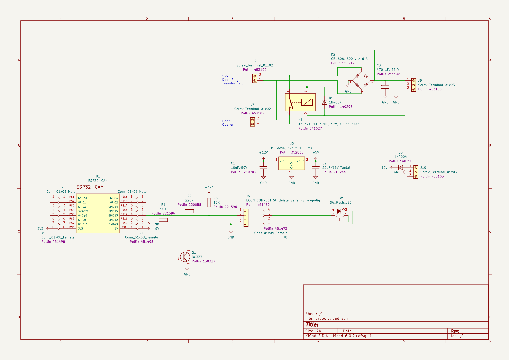

# QRDoor - Scans QRCodes via ESP32-CAM and send them via MQTT

(not fully finalized, QR is working, the additional IOs are not implemented yet)

QRDoor is a generic application to read QRCodes with a ESP32-CAM module and forward them via MQTT.

It also supports, controlled by MQTT :
- one Input (e.g. for adoor bell button)
- one triggered output port (for the door lock)

All the Wifi setup is made through the [WifiMQTTManager](https://github.com/dreed47/WifiMQTTManager/tree/master#access-point-configuration), which provides an easy to use setup hotspot.


## Limitations
Please be aware that the combination of cheap processor and low-cost camera is far behind the performance of a Desktop PC with a high speed & resolution webcam. What does that mean in detail?:
* The standard lens together with the auto focus allows only a small distance range where the qrcode can be placed (~25 cm). If it is too far, the qrcode becomes too small, but if it is too close, the picture becomes blurry
* The autofocus and the brightness control is very slow, and each picture change triggers a re-adjustment

Because of that it's quite impossible to just hold a mobile phone free hand anywhere in front of the camera. The movements of the hand are much quicker as the autofocus :-(

So to read a qrcode from any surface or from a phone, it's highly recommended to construct something like a filing for the object carrying the qrcode in front of the camera to keep the object in position so that the camera can generate a stable picture.

Also the user needs to be made aware that the recognition process can easily take 10 seconds...


## Hardware

Just as a starting point the io pins have been taken from [here](https://www.electroniclinic.com/esp32-cam-smart-iot-bell-circuit-diagram-and-programming/) and put into a KiCad schematic separated into two sections:
* one pcb close to the bell transformator containing the DC converter and the door opener output
* a second pcb carrying the ESP32cam and its voltage converter



## Setup

The development was made with the VSCode Arduino Extention, so the setup for the original Arduino IDE should be very simular.

1) First add (if not already done) the URL for the Espressif Board in "Board Manager / Addional URLs":“[https://dl.espressif.com/dl/package_esp32_index.json”](https://dl.espressif.com/dl/package_esp32_index.json%E2%80%9D)

2) In the Board Manager, search for "esp32" and install "Esp32 from Espressif Systems”
3) Select the right board: “ESP32 Wrover"
4) In the Library Manager, install several Libraries. Here's the output from the todays build log:

```
Used library            Version     Pfad                                                                             
WiFiMQTTManager Library 1.0.1-beta   
WiFiManager             2.0.15-rc.1            
WiFi                    2.0.0
Update                  2.0.0
WebServer               2.0.0
DNSServer               2.0.0
ArduinoJson             5.13.5
PubSubClient            2.8
FS                      2.0.0
SPIFFS                  2.0.0
```
Make sure the Arduino Json Library  is a **5.xx** version!!

In Tools-Board select :
- ESP32Wrover Module
- Speed 921600
- Flash Frequency 80Mhz
- Flash Mode QIO
- Partition Scheme: Huge app

## Hacks

After installing WiFiMQTTManager, go into the library file `.../WiFiMQTTManager.cpp` and move the `Serial.begin(115200);`line as the first line of the constructor

```WiFiMQTTManager::WiFiMQTTManager(int resetPin, char* APpassword) {
  Serial.begin(115200);
  wm = new WiFiManager;
  lastMsg = 0;
  formatFS = false;
  ```

add the line `client->setBufferSize(512);` after the `client.reset(new PubSubClient(_espClient));`

```
  client.reset(new PubSubClient(_espClient));
  client->setBufferSize(512);
  client->setServer(_mqtt_server, port);
  ```


comment out the line 158 `wm->resetSettings();` to not loose all settings after failed MQTT server attempt.. and modify delay timings

```
  client->setServer(_mqtt_server, port);
  delay(2000);
  Serial.print("WMM: attempting MQTT connection...");
  if (!client->connect(clientId)) {
    Serial.println("failed to connect to MQTT -wait 10 secs and restart...");
    delay(10000);
//    wm->resetSettings();
    ESP.restart(); 
```


Modify the `SPIFFS.begin()` line from

` if (SPIFFS.begin()) {`

to 

 `if (SPIFFS.begin(false) || SPIFFS.begin(true)){ `

to format the filesystem at the inital start


in \~/snap/arduino/85/.arduino15/packages/esp32/hardware/esp32/1.0.6/cores/esp32/main.cpp

increase the task stack size

```cpp
#ifndef CONFIG_ARDUINO_LOOP_STACK_SIZE
#define CONFIG_ARDUINO_LOOP_STACK_SIZE 8192
#endif

//// ---- ADD this -----
#define CONFIG_ARDUINO_LOOP_STACK_SIZE 32768
```

## Credits

- The program skeleton comes from the  WiFiMQTTManager demo code

- The image capture routines are from [GitHub - donny681/ESP32_CAMERA_QR](https://github.com/donny681/ESP32_CAMERA_QR)

-  The qrcode detection routines are from [GitHub - dlbeer/quirc: QR decoder library](https://github.com/dlbeer/quirc)
and

- qrcode code sample [GitHub - donny681/ESP32_CAMERA_QR](https://github.com/donny681/ESP32_CAMERA_QR)


